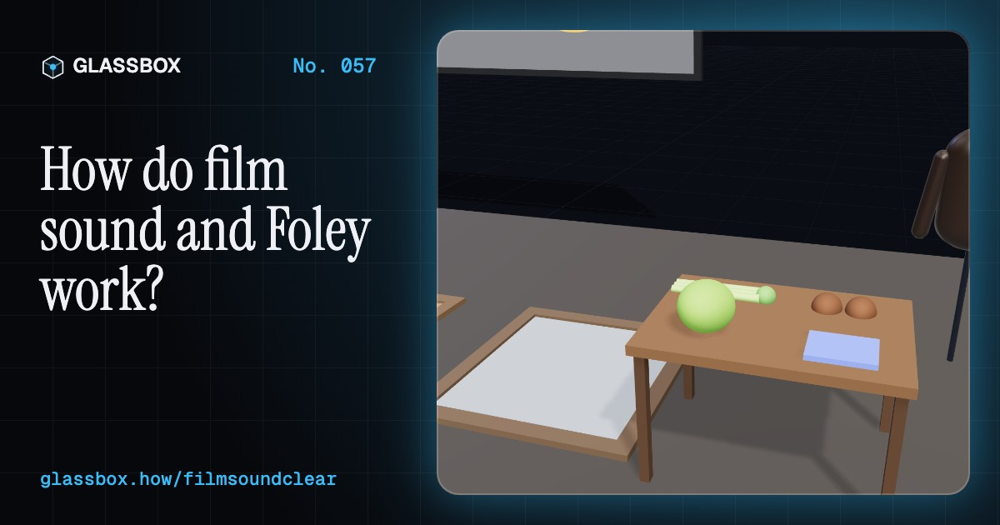
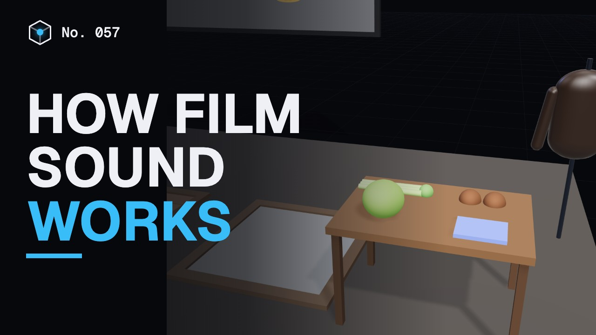
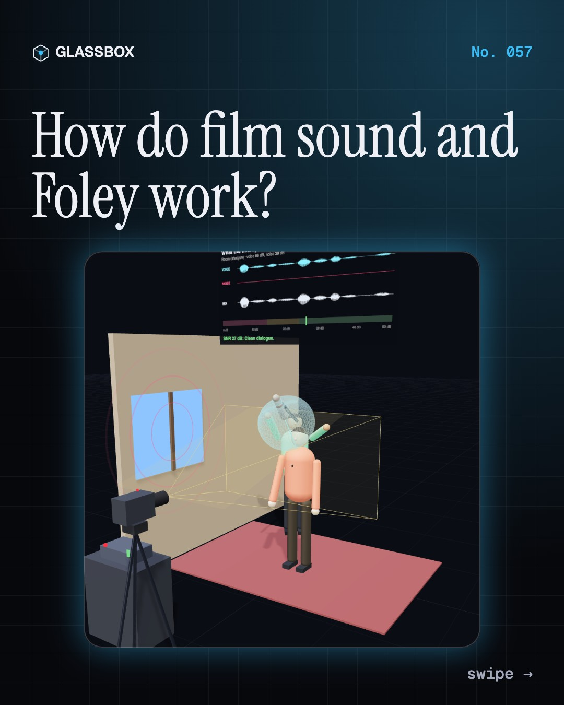
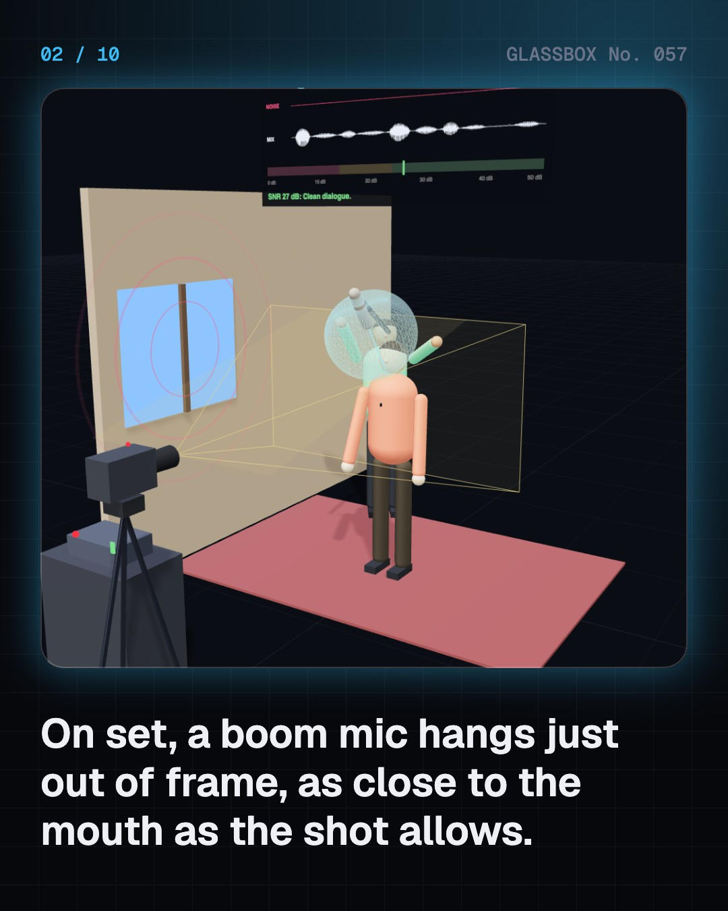
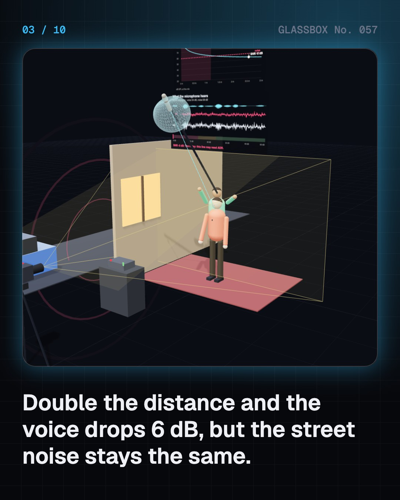
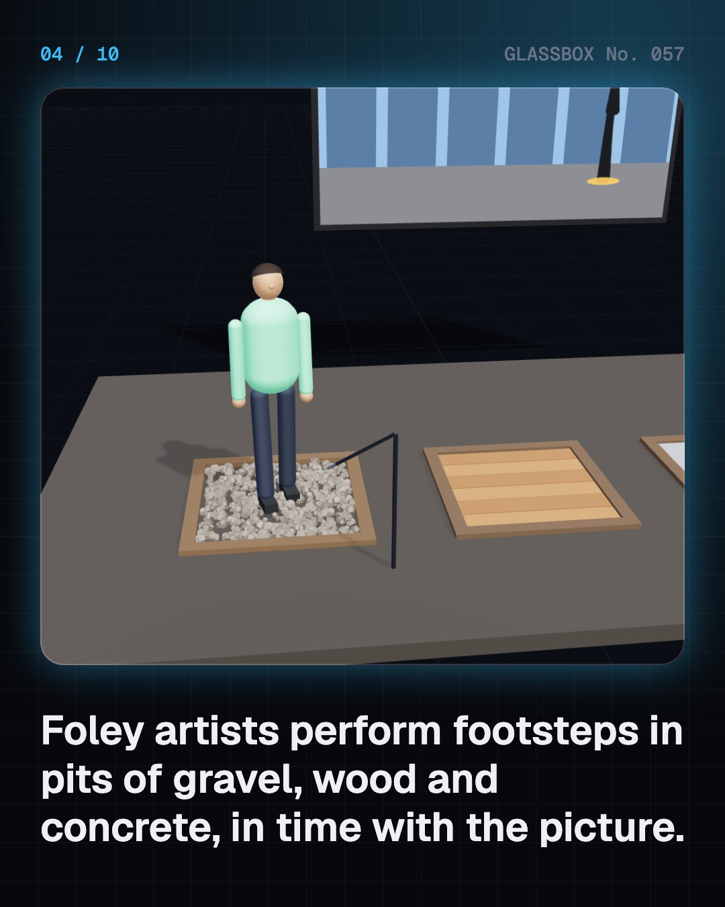

<!-- glassbox:start -->
<!-- Generated from glassbox.json by the Glassbox hub (npm run readme -- filmsoundclear). Edit glassbox.json, not this block. -->
<p align="center"><a href="https://glassbox-production-fd52.up.railway.app/e/filmsoundclear/"></a></p>

<h1 align="center">FilmSoundClear</h1>

<p align="center"><b>How do film sound and Foley work?</b><br>Most of what you hear in a film was never recorded on set. Hang a boom mic just out of shot, snap celery for breaking bones, build a monster's roar from three layers, re-voice a line in sync, and fly a helicopter over your head in Dolby Atmos.</p>

<p align="center"><a href="https://glassbox-production-fd52.up.railway.app/filmsoundclear/"><b>▶ Play with it</b></a> &nbsp;·&nbsp; <a href="https://glassbox-production-fd52.up.railway.app/e/filmsoundclear/">Read the 60-second explainer</a> &nbsp;·&nbsp; <a href="https://glassbox-production-fd52.up.railway.app/filmsoundclear/glassbox/reel.mp4">Watch the 40-second video</a></p>

<p align="center">
  <a href="https://glassbox-production-fd52.up.railway.app/e/filmsoundclear/"></a>
  <a href="https://glassbox-production-fd52.up.railway.app/e/filmsoundclear/"></a>
  <a href="LICENSE"></a>
  <a href="LICENSE-CONTENT.md"></a>
  <a href="#privacy"></a>
</p>

## In 60 seconds

1. **Voices on set.** A shotgun mic on a boom hangs just above the frame, as close to the mouth as the shot allows. Sound power falls with the square of distance: twice as far is 6 dB quieter, while the background noise stays the same. Actors also wear hidden lavalier mics, and the crew records 30 seconds of room tone.
2. **Foley.** Footsteps, rustling clothes and small props are added later by Foley artists who watch the film and perform in sync, named after Jack Foley at Universal from 1929. Celery snaps make breaking bones, coconut shells make hooves, and a punched cabbage makes a punch.
3. **Sound design.** Sounds that cannot be recorded are built from layers: a low rumble for weight, a mid growl for character and a high screech for bite. Designers pitch-shift, reverse and move them. A passing ship rises then falls in pitch: the Doppler effect.
4. **ADR and dubbing.** Noisy or weak lines are re-recorded in a booth to the picture: three beeps, then speak on the fourth. Viewers notice sound more than about 45 ms early or 125 ms late. Dubbing re-voices a whole film in another language, and India's biggest hits are released in five or more languages.
5. **The mix.** On a dubbing stage, mixers balance five stems: dialogue, music, effects, Foley and ambience, ducking the music under the words. Streaming targets about −27 LUFS of dialogue; cinemas are calibrated instead. 5.1 and 7.1 feed fixed speakers, while Dolby Atmos places sound objects anywhere, even overhead.
6. **In the cinema.** The film arrives as a Digital Cinema Package with up to 16 uncompressed channels. A processor and amplifiers drive speakers that stand behind a screen full of holes about 1.2 mm wide. Sound takes about 3 ms per metre, so the back row hears a little later, and phone speakers lose the deep bass.

## Words worth knowing

| Term | Meaning |
|---|---|
| **Production sound** | The dialogue and sound recorded on set while filming. |
| **Polar pattern** | How sensitive a microphone is in each direction; a shotgun hears mostly straight ahead. |
| **Inverse-square law** | Sound power falls with the square of distance: 6 dB less for each doubling. |
| **Foley** | Everyday sounds performed live in sync with the picture after filming. |
| **Layering** | Stacking several sounds so they play as one bigger sound. |
| **ADR** | Automated dialogue replacement: re-recording lines in a studio to match the lips on screen. |
| **Stem** | One group of sounds in a mix, such as all the dialogue or all the music. |
| **LUFS** | A measure of how loud a mix feels, used to set loudness targets. |
| **Dolby Atmos** | Cinema sound with ceiling speakers where each sound is an object with a 3D position. |

## A short history

**A century from pianists in the dark to helicopters flying over your head in Dolby Atmos.**

- **1927** · The Jazz Singer talks (Warner Bros.; Al Jolson, New York, USA)
- **1929** · Jack Foley performs sound to picture (Jack Foley, Universal Studios, Hollywood, USA)
- **1931** · India's first talkie: Alam Ara (Ardeshir Irani, Bombay (Mumbai), India)
- **1940** · Fantasound surrounds the audience (Walt Disney Studios and RCA, Broadway Theatre, New York, USA)
- **1977** · Star Wars and Dolby Stereo (Lucasfilm; Dolby Laboratories, USA)
- **1979** · The first "sound designer" (Walter Murch, USA)
- **1992** · Digital sound in the cinema (Dolby Laboratories, USA)
- **2009** · An Oscar for Resul Pookutty (Resul Pookutty, with Ian Tapp and Richard Pryke, Los Angeles, USA)

The full story, with 25 moments, charts, people and 35 sources: [glassbox.how/e/filmsoundclear/history](https://glassbox-production-fd52.up.railway.app/e/filmsoundclear/history/). The data lives in [`history.json`](history.json).

## Video and slides

Made with the Glassbox studio from this box's storyboard (`window.glassbox.director`). Free to reuse under CC BY 4.0.

<a href="https://glassbox-production-fd52.up.railway.app/filmsoundclear/glassbox/video.mp4"></a>

<p><a href="glassbox/slide-1.jpg"></a> <a href="glassbox/slide-2.jpg"></a> <a href="glassbox/slide-3.jpg"></a> <a href="glassbox/slide-4.jpg"></a></p>

| File | What | Size |
|---|---|---|
| [`glassbox/reel.mp4`](https://glassbox-production-fd52.up.railway.app/filmsoundclear/glassbox/reel.mp4) | Reel / Short, with captions and soundtrack | 1080×1920 |
| [`glassbox/video.mp4`](https://glassbox-production-fd52.up.railway.app/filmsoundclear/glassbox/video.mp4) | YouTube video, with captions and soundtrack | 1920×1080 |
| `glassbox/slide-1…10.jpg` | Instagram carousel | 1080×1350 |
| `glassbox/thumb.jpg` | YouTube thumbnail | 1280×720 |
| `glassbox/cover.jpg` | Share card and repo social preview | 1200×630 |
| [`glassbox/history-reel.mp4`](https://glassbox-production-fd52.up.railway.app/filmsoundclear/glassbox/history-reel.mp4) | “History in 10 moments” Reel / Short | 1080×1920 |
| `glassbox/history-slide-*.jpg` | History carousel | 1080×1350 |
| `glassbox/post.json` | Post copy and schedule used by the publish kit | |

## Privacy

This box has no accounts and no ads, and it ships its own fonts and libraries. When you run it yourself it sends nothing anywhere. On glassbox.how, the site's `/bar.js` also loads Glassbox's analytics: **Google Analytics** to count visits (it asks first in the EU, UK and Switzerland, and stays off when your browser sends Global Privacy Control or Do Not Track) and **ClickTrust** to detect bots.

It remembers a few things **in your own browser only**, and never sends them anywhere:

| Browser storage key | What it holds |
|---|---|
| `filmsoundclear.v1` | Which chapters you have opened, your best quiz scores, and sound on or off. |

Exactly what each one sees is at [glassbox.how/privacy](https://glassbox-production-fd52.up.railway.app/privacy/).

## Licences

- **Code:** [MIT](LICENSE). Use it, change it, ship it.
- **Explanations, text, images and videos** (`glassbox.json`, `glassbox/`): [CC BY 4.0](LICENSE-CONTENT.md). Credit “Glassbox, glassbox.how/e/filmsoundclear”.
- **Third-party parts** keep their own licences: [three.js](https://threejs.org) (MIT), [Geist, Instrument Serif](https://openfontlicense.org) (SIL OFL 1.1).
- The Glassbox name and logo aren't covered by either licence. See the [terms](https://glassbox-production-fd52.up.railway.app/terms/).

Found a mistake? [Open an issue](https://github.com/bdeeps/filmsoundclear/issues). Corrections happen in public.
<!-- glassbox:end -->

## Run it

It's plain HTML, CSS and JavaScript. No build step and no dependencies. Run locally, it contacts no other website.

```bash
python3 -m http.server 8000
```

Three.js and the fonts ship in `vendor/` and `fonts/`, so it also works offline.

Then open http://localhost:8000.

## How it's built

| File | What |
|---|---|
| `index.html`, `css/app.css` | The page and its styles |
| `js/app.js`, `js/stage.js`, `js/ui.js`, `js/kit.js` | The shared Glassbox 3D engine: chapters, 3D stage, controls, quiz, video director |
| `js/chapters/*.js` | One file per chapter: the 3D model, controls, text, key terms, quiz and video scenes |
| `js/sound.js` | FilmSoundClear's shared parts: every sound synthesised from maths (voice, room tone, footsteps, Foley props, roar layers, Doppler pass-by, helicopter, music), a Web Audio player that obeys the mute button, waveform and spectrum boards, and generic props (mannequin, shotgun mic, speaker, camera, polar-pattern lobes) |
| `glassbox.json` | Title, question, explainer beats, key terms, browser storage and credits shown on glassbox.how |
| `reel` in each chapter | The storyboard the Glassbox studio records into short videos |
| `glassbox/` | The published video, slides, thumbnail and post copy |
| `fonts/`, `vendor/three/` | Self-hosted Geist and Instrument Serif (SIL OFL 1.1) and three.js (MIT) |
